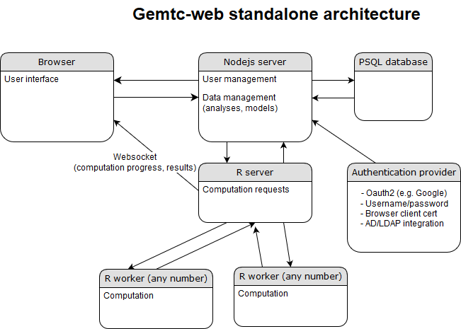

gemtc-web
=========

User interface for evidence synthesis based on the [gemtc R package](https://github.com/gertvv/gemtc) and [Patavi](https://github.com/drugis/patavi). For more information on all components of the [ADDIS project](https://github.com/drugis/addis-core), please refer to the [overall readme](https://github.com/drugis/addis-core/blob/master/OVERALL-README.md).

Architecture
------------

The Gemtc-web system consists of several components:



The web frontend talks to a NodeJS backend, which performs user and data management, and queues R tasks in patavi. Data are stored in a PostgreSQL database, and patavi model results are also cached there. Patavi R tasks expose a websocket URL to the frontend, which listens there for progress updates and results. Running gemtc model tasks requires at least one patagi gemtc worker.

Prerequisites for running gemtc-web
-----------------------------------

- A PostgreSQL instance with an initialised database. You can create one in a docker container by running the `setup-db.sh` script. Make sure to change the passwords from the default.

If you already have a postgresql database you can use, it can be initialised as follows (change passwords as desired):

    CREATE USER gemtc WITH PASSWORD 'develop';
    CREATE DATABASE gemtc ENCODING 'utf-8' OWNER gemtc;

Create a .pgpass in the user home to store the database password
the file should contain a line with the following format hostname:port:database:username:password

    localhost:5432:gemtc:gemtc:develop

Create the schema (shell script)

    for i in changesets/create-database-changeset-*.sql; do psql -h localhost -U gemtc -d gemtc -f $i; done

- A patavi-server instance along with a rabbitMQ service. see the [patavi repository](https://github.com/drugis/patavi) for installation and running instructions.

- At least one gemtc patavi worker, started by executing the `run-worker.sh` script.

Running as Docker container
===========================

Building the image (optional)
-----------------------------

You can build a new local image by executing the `build-docker.sh` script. This would be required for example if you wish to change the default SSL keys. Note that this script assumes that your keys are present in an `ssl` subdirectory of the main gemtc directory. Also note that, if your patavi server presents a certificate that is not trusted by default, there should be a CA certificate for the signing certificate authority of your patavi container in this directory. The default patavi server image presents a certificate signed by the Drugis [self-signed certificate authority](https://drugis.org/files/ca-crt.pem)

The `build-docker.sh` script also lets you specify the signin method via command line arugment. The current options are Google OAuth 2.0 (`GOOGLE`) and username/password (`LOCAL`). The default signin method is Google OAuth 2.0.

You can add users for the `LOCAL` signin method by using the `add-user.sh` script. Note: this script relies on external utilities which must be installed by running `yarn` first, one time.

Running the container
-----------------------

Execute the `run-gemtc-docker.sh` script.

If you built the container with a specific login method arugment, you should run the `run-gemtc-docker.sh` script with the same one.

e.g.:
```
./build-docker.sh LOCAL
./run-gemtc-docker.sh LOCAL
```

**Note** that you should probably change the default settings in the script (e.g. check whether the link arguments match the names of your containers, and the names of the certificate files match those in your `ssl` directory if you built your own image). The script also assumes that the sql database and patavi server and worker are already set up and running. The run script runs the `addis/gemtc` image, which will be pulled from docker hub by default. The default image comes with SSL keys which assume `localhost` or `localdocker` CNs, and which are signed by our [self-signed certificate authority](https://drugis.org/files/ca-crt.pem).

Because the default patavi-server image users a certificate signed by our [certificate authority](https://drugis.org/files/ca-crt.pem) you need to add this certificate to the browser's trusted authorities for R results to be displayed.

Development
-----------

If you wish to run the application locally for development, follow these steps:

- (Optional) Initialise and update the scss from the drugis main project

    git submodule init
    git submodule update

- Compile the scss to css using compass

    compass compile

- Use yarn to install the dependencies

    yarn

- Ensure that your prerequisites are in place (see above)

- Setup environment variables

```
    export GEMTC_GOOGLE_KEY=100331616436-dgi00c0mjg8tbc06psuhluf9a2lo6c3i.apps.googleusercontent.com
    export GEMTC_GOOGLE_SECRET=9ROcvzLDuRbITbqj-m-W5C0I
    export DB_HOST=<pc-name>.spice.drugis.org
    export GEMTC_DB=gemtc
    export GEMTC_DB_USERNAME=gemtc
    export GEMTC_DB_PASSWORD=develop
    export GEMTC_HOST=http://localhost:3001
    export GEMTC_AUTHENTICATION_METHOD=GOOGLE
    export PATAVI_HOST=localhost
    export PATAVI_PORT=3000
    export PATAVI_CLIENT_KEY=path-to/app-env-key.pem
    export PATAVI_CLIENT_CRT=path-to/app-env-crt.pem
    export PATAVI_CA=path-to/provider-name.crt
```

Note: this google key/secret combination expects the server to run at localhost:3001

Note: replace the path with the location of your SSL client key and certificate

Build the application

    npm run build-prod

Run the application

    npm start

Now visit the app at http://localhost:3001

Running tests
-------------
The Angular app is tested by karma:

    npx karma start

The node backend is tested by mocha:

    npx mocha

To run nightwatch integration tests:

    set env variable GEMTC_NIGHTWATCH_URL ( b.v. $GEMTC_HOST)

    sudo npm install -g nightwatch
    cd test/integration
    wget http://selenium-release.storage.googleapis.com/2.45/selenium-server-standalone-2.45.0.jar
    node gemtc &
    nightwatch --config nightwatch-local.json
